# Call Graph — `Finviz_News_Processing.py`

This document describes the **internal call relationships** in `Finviz_News_Processing.py`, plus the **key external calls** (requests/pandas/sqlalchemy/pickle/pathlib).

## Mermaid call graph (high-level)

```mermaid
%%{init: {"themeVariables": {"fontSize": "20px"}, "flowchart": {"nodeSpacing": 50, "rankSpacing": 60}}}%%
flowchart TD
  subgraph FinvizNewsImporter
    FNI_init["FinvizNewsImporter.__init__(url, symbol=None)"]
    FNI_get["get_finviz_url_with_symbol()"]
    FNI_import["import_finviz_news()"]
    FNI_call["__call__()"]
  end

  subgraph Controller
    C_init["Controller.__init__()"]
    C_ensure["_ensure_symbol_news_table(symbol)"]
    C_mr_sym["_most_recent_link_symbol_cached(symbol)"]
    C_mr_all["_most_recent_link_all()"]
    C_cmp["_compare_most_recent_link(symbol)"]
    C_upd_one["_update_most_recent_link_cached(symbol, link)"]
    C_upd_all["_update_most_recent_link_cached_all()"]
    C_load["_load_queue()"]
    C_save["_save_queue()"]
    C_assign["_assign_skip_status()"]
    C_tables["_get_tables()"]
    C_exists["_get_table_exists(symbol)"]
    C_store["store_symbol_news(symbols)"]
  end

  subgraph NewsQueue
    NQ_init["NewsQueue.__init__(maxsize=0, threshold=95)"]
    NQ_empty["is_empty()"]
    NQ_enq["enqueue(node, block=True, timeout=None)"]
    NQ_benq["bulk_enqueue(nodes, block=True, timeout=None)"]
    NQ_deq["dequeue(block=True, timeout=None)"]
    NQ_iter["__iter__()"]
    NQ_trav["traverse(threshold=None)"]
    NQ_rm["remove_node(max_headline_count)"]
    NQ_snap["_snapshot_items()"]
    NQ_save["save_pickle(file_path='news_queue.pkl')"]
    NQ_load["load_pickle(file_path='news_queue.pkl')"]
  end

  %% Internal edges
  FNI_init -->|if symbol| FNI_get
  FNI_call --> FNI_import
  FNI_import -->|if not symbol| FINVIZ_URLS["utils.finviz_api_urls[...]"]

  C_init --> C_q["NewsQueue()"]
  C_init -->|reads| SQL_pd_read["pd.read_sql('SELECT * FROM cache_most_recent_link', con=engine)"]

  C_cmp --> C_mr_all
  C_cmp --> C_mr_sym

  C_upd_all --> C_mr_all

  C_load --> NQ_load
  C_save --> NQ_save

  C_assign --> C_mr_all

  C_exists --> C_tables

  C_store --> C_exists
  C_store -->|if missing| C_ensure
  C_store --> FNI_import
  C_store --> NQ_save

  NQ_trav --> NQ_empty
  NQ_trav --> NQ_rm
  NQ_save --> NQ_snap
  NQ_load --> NQ_benq
```

## Call graph (detailed outline)

### `FinvizNewsImporter`

- **`FinvizNewsImporter.__init__(url: str, symbol: str | None = None)`**
  - **Calls**
    - `get_finviz_url_with_symbol()` **if** `symbol` is truthy
  - **Notes**
    - Stores `self.url` as either the passed key (`"stock_news"`, `"crypto_news"`, etc.) or a **fully materialized URL** when a symbol is provided.

- **`FinvizNewsImporter.get_finviz_url_with_symbol() -> str`**
  - **Calls/uses**
    - `api_keys.finviz_api_key` (string interpolation)
  - **Returns**
    - Fully formed Finviz Elite export URL for `self.symbol`
  - **Raises**
    - `ValueError` if `self.url` is not `"stock_news"` or `"crypto_news"`

- **`FinvizNewsImporter.import_finviz_news()`**
  - **Calls/uses**
    - `utils.finviz_api_urls[self.url]` **if** `self.symbol` is falsy (meaning `self.url` is treated as a key)
    - `requests.get(self.url)`
    - `response.content.decode('utf-8')`
    - `pd.read_csv(StringIO(response_text))`
  - **Returns**
    - `pd.DataFrame` of the CSV response

- **`FinvizNewsImporter.__call__()`**
  - **Calls**
    - `import_finviz_news()`

### `Controller`

- **`Controller.__init__()`**
  - **Calls/uses**
    - `sqlalchemy.create_engine(...)`
    - `pd.read_sql("SELECT * FROM cache_most_recent_link", con=self.engine)`
    - `NewsQueue()` (constructs `self.q`)
  - **Side effects**
    - Opens DB engine handle
    - Loads cache table into `self.cache_most_recent_link`

- **`Controller._ensure_symbol_news_table(symbol: str) -> None`**
  - **Calls/uses**
    - `sqlalchemy.inspect(self.engine).get_table_names()`
    - `sqlalchemy.MetaData()`
    - `sqlalchemy.Table(...)` + `sqlalchemy.Column(...)`
    - `md.create_all(self.engine)`
  - **Purpose**
    - Ensures per-ticker table exists with columns: `Title`, `Source`, `Date`, `Url`, `Category`, `Ticker`

- **`Controller._most_recent_link_symbol_cached(symbol: str) -> str`**
  - **Calls/uses**
    - `self.cache_most_recent_link.loc[...]` (pandas filtering)

- **`Controller._most_recent_link_all() -> pd.DataFrame`**
  - **Calls/uses**
    - `requests.get(finviz_api_urls['screener'])`
    - `pd.read_csv(StringIO(response_text))`
    - DataFrame selection: `df[['Ticker', 'News URL']]`
  - **Side effects**
    - Sets `self.most_recent_link_all_df`

- **`Controller._compare_most_recent_link(symbol: str) -> bool`**
  - **Calls**
    - `_most_recent_link_all()` **if** `self.most_recent_link_all_df is None`
    - `_most_recent_link_symbol_cached(symbol)`
  - **Uses**
    - `self.most_recent_link_all_df.loc[...]` to get latest link from screener

- **`Controller._update_most_recent_link_cached(symbol: str, link: str)`**
  - **Calls/uses**
    - `self.cache_most_recent_link.loc[...] = link`
    - `self.cache_most_recent_link.to_sql("cache_most_recent_link", con=self.engine, if_exists='replace', index=False)`

- **`Controller._update_most_recent_link_cached_all(self)`**
  - **Calls**
    - `_most_recent_link_all()`
  - **Calls/uses**
    - `self.most_recent_link_all_df.to_sql("cache_most_recent_link", con=self.engine, if_exists='replace', index=False)`

- **`Controller._load_queue(self)`**
  - **Calls**
    - `self.q.load_pickle()` (classmethod on `NewsQueue` invoked via instance reference)
  - **Side effects**
    - Replaces `self.q` with loaded queue

- **`Controller._save_queue(self)`**
  - **Calls**
    - `self.q.save_pickle()`

- **`Controller._assign_skip_status(self)`**
  - **Calls/uses**
    - Iterates `self.q.queue` under `for node in self.q.queue:` (note: not locked here)
    - Reads `self.most_recent_link_all_df` and `self.cache_most_recent_link` (both pandas)
  - **Sets**
    - `node.skip = True/False` based on cached vs most recent link presence/equality

- **`Controller._get_tables(self) -> list[str]`**
  - **Calls**
    - `sqlalchemy.inspect(self.engine).get_table_names()`

- **`Controller._get_table_exists(self, symbol: str) -> bool`**
  - **Calls**
    - `_get_tables()`

- **`Controller.store_symbol_news(self, symbols: list[str])`**
  - **Calls**
    - `_get_table_exists(symbol)`
    - `_ensure_symbol_news_table(symbol)` **when table does not exist**
    - `pd.read_sql(f"SELECT * FROM `{symbol}` limit 100", con=self.engine)`
    - `FinvizNewsImporter(url="stock_news", symbol=symbol)`
    - `importer.import_finviz_news()`
    - `pd.to_datetime(results['Date'])`
    - `self.q.save_pickle()`
    - `results_todb.to_sql(f"{symbol.lower()}", con=self.engine, if_exists='append', index=False)` **if** new URLs exist
    - `time.sleep(5)` **when** processing multiple symbols (`block=True`)
  - **Also uses**
    - `datetime.now() - timedelta(days=1)` for daily headline count
    - `with self.q.mutex:` while updating a matching node’s `headline_count`

### `NewsNode`

- **`NewsNode` dataclass**
  - Pure data container (no calls)
  - Fields: `symbol`, `headline_count`, `skip=False`

### `NewsQueue (queue.Queue subclass)`

- **`NewsQueue.__init__(maxsize: int = 0, threshold: int = 95)`**
  - **Calls**
    - `super().__init__(maxsize=maxsize)`
  - **Validates**
    - `threshold` is within `[90, 100]`
  - **Initializes**
    - `iteration_headline_sum`, `_staged_symbols`, `threshold`

- **`NewsQueue.is_empty() -> bool`**
  - **Calls**
    - `self.empty()` (from `queue.Queue`)

- **`NewsQueue.enqueue(node, block=True, timeout=None)`**
  - **Calls**
    - `self.put(node, block=block, timeout=timeout)`

- **`NewsQueue.bulk_enqueue(nodes, block=True, timeout=None)`**
  - **Calls**
    - `enqueue(...)` for each node

- **`NewsQueue.dequeue(block=True, timeout=None)`**
  - **Calls**
    - `self.get(block=block, timeout=timeout)`

- **`NewsQueue.__iter__()`**
  - **Calls/uses**
    - `with self.mutex: snapshot = list(self.queue)`
  - **Returns**
    - Iterator over FIFO snapshot (does not mutate live queue)

- **`NewsQueue.traverse(threshold: int | None = None) -> List[str]`**
  - **Calls**
    - `is_empty()`
    - `remove_node(max_headline_count=remaining)` in a loop
  - **Uses**
    - Internal state: `iteration_headline_sum`, `_staged_symbols`
  - **Returns**
    - List of removed symbols for this traversal call

- **`NewsQueue.remove_node(max_headline_count: int) -> str | None`**
  - **Calls/uses**
    - `with self.mutex:` and direct deque ops: `self.queue.popleft()` / `self.queue.append(...)`
  - **Logic**
    - Rotates through up to `n` items, skipping nodes with `node.skip == True`
    - Selects first eligible node with `node.headline_count < max_headline_count`
    - Updates `iteration_headline_sum` (special-cases `0` as `+1`)

- **`NewsQueue._snapshot_items() -> List[NewsNode]`**
  - **Calls/uses**
    - `with self.mutex: return list(self.queue)`

- **`NewsQueue.save_pickle(file_path='news_queue.pkl') -> Path`**
  - **Calls**
    - `_snapshot_items()`
    - `Path(file_path)` + `path.parent.mkdir(...)`
    - `path.open("wb")`
    - `pickle.dump(payload, f)`
  - **Pickles**
    - `maxsize`, `threshold`, and `items` snapshot

- **`NewsQueue.load_pickle(file_path='news_queue.pkl') -> NewsQueue`** (classmethod)
  - **Calls**
    - `Path(file_path)` + `path.open("rb")`
    - `pickle.load(f)`
    - `cls(maxsize=maxsize, threshold=threshold)`
    - `bulk_enqueue(items)`
  - **Returns**
    - Rehydrated `NewsQueue`

## Entry points / “what you’d call”

- **Import news for a ticker (programmatic):**
  - `FinvizNewsImporter(url="stock_news", symbol="AAPL").import_finviz_news()`
  - or `FinvizNewsImporter(... )()` (calls `__call__` → `import_finviz_news`)

- **Update DB for one or more tickers:**
  - `Controller().store_symbol_news(["AAPL", "MSFT"])`

